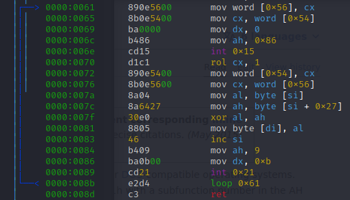
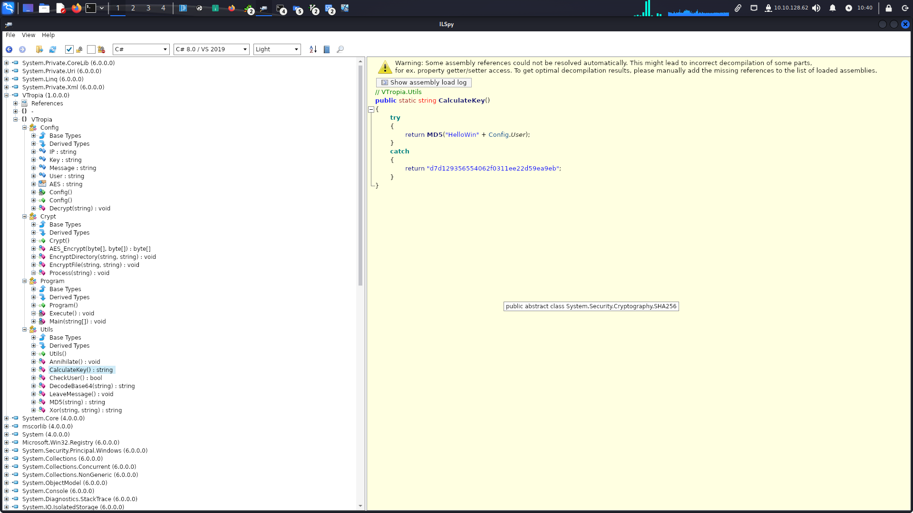

Итоговый отчет по НТО от команды `pwn is 0x12c bucks`
==========

# Task-Based

## crypto1
Решалка: [script.sage](crypto1/script.sage)

Дан какой-то шифровальщик, который шифрует каждый байт независимо и детерминированно. Вычислим значения для всех байтов (они различны для различных байтов), теперь мы умеем восстанавливать байт исходника по шифрованному байту (кинем все в dictionary или что-то подобное). Потом последовательно расшифруем каждый байт.

Флаг: `nto{5tr4ng3_gr0up_5tr4ng3_l0g_and_depressed_kid_zxc_ghoul}`


## crypto 2
Заметим, что в одном случае возвращается семь в большой степени по модулю, а в другом - случайное число в диапазоне от половины модуля до модуля. Сделаем предположение, что в первом случае вполне вероятно, что сервер вернет число, меньшее чем половина модуля. Запросим бит 10 раз, и если все 10 раз получилось число из диапазона `[n // 2; n]`, то скажем, что это 0, иначе 1. Скрипт для решения: [crypto20.py](crypto2/crypto20.py).

Флаг: `nto{0h_n0_t1m1ng}`

## pwn 2
Готовый эксплоит: [solve.py](pwn2/solve.py)

Исполняемый файл таков, что у нас есть доступ на запись к памяти размера `0x100` байт, при этом программа может совершить вызов функции `fclose` на с аргументом - указателем, состоящим из первых 8 байт этой области.

Создадим поддельную структуру `FILE *`, такую, что выполнив `fclose` на ней, мы получим шелл.

Для этого сначала вычислим адрес libc, воспользовавшись тем, что вывод данных производится при помощи `printf(data)`.

Далее создаем структуру с поддельной `vtable` таким образом, что на самом деле будет вызвана функция по нашему адресу. Находим подходящий адрес при помощи `one_gadget`.

И затем получаем флаг: `NTO{533_y0u_47_5ch00l_p4l}`

## pwn 3
Готовый эксплоит: [solve.py](pwn3/solve.py)

Как можно заметить, программа позволяет нам смотреть на участки памяти, которые уже были освобождены, а также редактировать их.

Для начала создаем несколько записей, потом удаляем их, тем самым заполняя tcache и unsorted bins. Смотря на содержимое одного из чанков, который попал в unsorted bins, мы можем получить адрес, куда была загружена libc.

Теперь переопределим `__free_hook` адресом (8 байт), прыгнув на который наша программа выдаст нам шелл. Для этого переопределим 4 байта по адресу `__free_hook`, а затем оставшиеся 4 байта по адресу `__free_hook+4`.

Переопределять 4 байта мы можем при помощи изменения структуры `tcache` таким образом, что адрес первого чанка будет указывать по адресу записи. Таким образом, при записи оценки (32-битного числа), мы запишем 4 байта в нужное место.

Осталось вызвать функцию `free` и получить флаг: `NTO{3ww_7h15_7c4ch3_15_p0150n3d}`

## rev 1
Открыв файл в дизассемблере, видим цикл с двумя инструкциями `int 0x21` и `int 0x15`.



`int 0x21` - это вызов DOS API, при этом `ah` устанавливается в `9` - записать строку в stdout.

`int 0x15` - вызов BIOS, при `ah` равным `0x86` - ожидание.

Заменив вызов `int 0x15` двумя байтами `0x90` (NOP), задержка исчезает и мы получаем флаг: `nto{h3ll0_n3w_5ch00l_fr0m_0ld!!}`

## web 1
Что происходит на сайте: при нажатии на кнопку calculate, он отправляет зашифрованные данные с клиента по сокету на сервер в формате `json`, затем сервер возвращает ответ. Если перехватить ответ сервера, видим, что он возвращает все данные, которые были получены, плюс что-то рассчитывает.

Замечание 1: данные отправляются на сервер в виде `{format: 'json', data: '<here_is_your_data>'}`. Поскольку явно указан формат данных, наверное можно отправить не json. Например, xml. Поскольку можно отправить xml, можно выполнить External Entity Injection: пейлоад будет выглядеть примерно так: `{"format": "xml", "data": "<!DOCTYPE foo [ <!ENTITY xxe SYSTEM \'file:///flag.txt\' >]><data><countries>&xxe;</countries><startdate></startdate><enddate></enddate><resttype></resttype></data>"}`

Флаг: `nto{w3bs0ck3ts_plu5_xx3_1s_l0v3}`

## web 2
Видно, что первый сервис формирует HTTP запрос ко второму самостоятельно, не экранируя при этом каким-либо образом параметр username. То есть, мы можем сформировать некорректный запрос, получив тем самым сообщение об ошибке, в котором будет содержаться флаг.

Пример запроса: 
```http
POST /register
username=%0A&password=qq
```


Флаг: `NTO{request_smuggling_917a34072663f9c8beea3b45e8f129c5}`

## web 3
Готовый эксплоит: [solve.py](web3/solve.py)

Нам предоставлена возможность совершать prototype pollution по адресу /pollute/key/value

Покопавшись в коде, понимаем, что можем передавать дополнительные параметры в функцию `passport.authenticate` (index.js строки 48-52)

```js
app.get("/auth", passport.authenticate('local', {
    successReturnToOrRedirect: '/',
    failureRedirect: '/error',
    failureMessage: true
}))
```

Посмотрев на список возможных параметров `AuthenticateOptions`, находим интересное поле `userProperty`, которое позволяет нам изменять объект `req`. Заменим это свойство на `isLocalRequest`, чтобы обмануть проверку в index.js:61. Однако этого мало, ведь при новом запросе создастся новый объект `req`, так что копнув глубже, мы можем обнаружить, что мы можем указать страницу, на которую мы хотим попасть после авторизации, для этого должно присутствовать поле `returnTo` у объекта `req.session` (authenticate.js:260-267)

```js
if (options.successReturnToOrRedirect) {
    var url = options.successReturnToOrRedirect;
    if (req.session && req.session.returnTo) {
        url = req.session.returnTo;
        delete req.session.returnTo;
    }
    return res.redirect(url);
}
```

Используя prototype pollution, устанавливаем значение этого поля в `'/admin/flag'` и получаем флаг: `nto{pr0t0typ3_pollut10n_g4dged5_f56acc00f5eb803de88496b}`

# Расследование инцидентов

## Машина 1

Сначала сбросим пароль от рута, например как описано в этой статье: [Статья](https://en.wikibooks.org/wiki/Linux_Guide/Reset_a_forgotten_root_password)

### Как злоумышленник попал на машину?

Находим файл minecraft.jar, декомпилируем, находим реверс шелл .

### Как повысил свои права?

У find стоит suid-бит.

### Как узнал пароль от passwords.kdbx?

В загрузках лежат исходники logkeys, которая сохраняет нажатия клавиш. В логах шелла рута лежит информация о запуске бинарника logkeys. Потом кто-то ввел на компе мастер-пароль от keepass2, его записал кейлоггер.

### Куда logkeys пишет логи

В логах шелла рута есть строчка cat /var/log/logkeys.log - туда и записаны все логи. Запускаем logkeys на машине, пробуем что-нибудь написать, читаем файл и видим, что в него записалось все, что нужно . Вызываем logkeys –help, он выдает гитхаб . На гитхабе в ридми написано, что дефолтная папка сохранения логов как раз та, которая нужна 

### Пароль от чего лежит в passwords.kdbx?

Открываем keypass, вводим мастер-пароль, и видим, что там админский пароль от удаленного компа на винде (видимо, корпоративного) .

## Машина 2

### Какой пароль от Ransomware?

Насколько я понял, ransomware - exe-шник, который лежал на первой машине. Его можно декомпилировать каким-нибудь .NET-декомпилятором, увидеть примерно как работает код    Затем можно написать на его основе дешифровальщик 
Пароль, с которым запускался EncryptFile: 084b988baa7c8d98cda90c5fe603c560

### Какие процессы в системе являются вредоносными?
Открываем защитник windows и смотрим все угрозы, которые он нашел. Он нашел:
Backdoor:MSIL/Bladabindi.AP Затронутые им процессы 
Тот же бекдор в программах Doom.exe и еще каких-то 
Behaviour:Win32/MpTamperImgDeb.A. Затронутые им процессы 

Есть CLR-логи запуска Doom.exe 
Если его декомпилировать (а там опять .net), то можно заметить, что в мейне он не запускает игру. Вместо этого он запускает 5 странных процессов, ждет 60 секунд, удаляет все следы и выключается 

После деобфускации пяти файлов, лежащих внутри Doom.exe, находим в каждом из них имя файла в переменной EXE . Находим в каждом из них бекдор Njrat, кажется здесь  функция с основным взаимодействием, т. к. там заифано куча команд. Собственно, если деобфусцировать все 5 файлов, можно найти имена зараженных системных приложений: explorer, runtime broker, host process for windows tasks, security health service, antimalware service executable. Там же видим кусок кода, где здоровый файл удаляется и заменяется скачанным пропатченным через бекдор  (это еще и дополнение по вопросу о том, как произошла доставка по на компьютер)

### Как произошла доставка вредоносного ПО?

У злоумышленника был доступ к компьютеру по rdp с предыдущей машины, плюс, если поискать файл VTropia.exe, который был на предыдущей машине и при этом не гуглится, то можно найти логи его запуска => скорее всего вредоносное ПО было доставлено через RDP с предыдущей машины.

### Какие средства обфускации были использованы?

Точно можно найти одно: если вытащить из doom.exe бинволком файлы, которые внутри него сидят и декомпилировать, то там будет сигнатурка о том, что использован Eziriz’s “.NET Reactor” 

Есть сигнатура .NET reactor, плюс тулза с гитхаба, предназначенная специально для него, справляется частично его деобфусцировать. [https://github.com/SychicBoy/NETReactorSlayer](https://github.com/SychicBoy/NETReactorSlayer)
