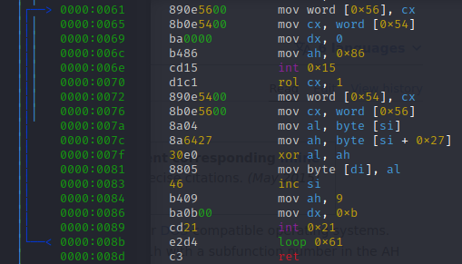

Открыв файл в дизассемблере, видим цикл с двумя инструкциями `int 0x21` и `int 0x15`.

`int 0x21` - это вызов DOS API, при этом `ah` устанавливается в `9` - записать строку в stdout.

`int 0x15` - вызов BIOS, при `ah` равным `0x86` - ожидание.

Заменив вызов `int 0x15` двумя байтами `0x90` (NOP), задержка исчезает и мы получаем флаг: `nto{h3ll0_n3w_5ch00l_fr0m_0ld!!}`